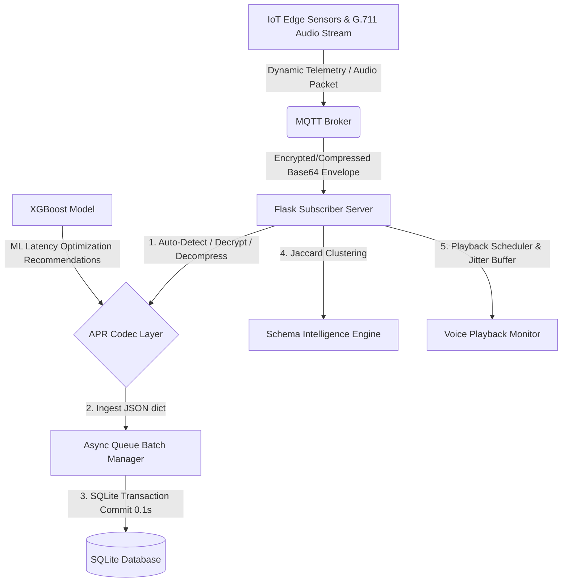

# 📑 Adaptive Policy Recommendation (APR) 및 G.711 Voice over MQTT 통합 시스템 설명서

본 시스템은 **Industrial IoT** 환경에서 대규모 실시간 센서 데이터 송수신을 최적화하기 위해 구축된 차세대 데이터 게이트웨이 및 실험용 시뮬레이션 플랫폼입니다. 머신러닝 기반의 동적 통신 정책 설정, 종단간 암호화/압축 코덱, 지연 없는 비동기 데이터베이스 배치 파이프라인, 비정형 데이터 정제용 스키마 지능, 그리고 실시간 오디오 스트리밍을 제어하는 Jitter Buffer 기술이 하나로 통합되어 있습니다.

---

## 🏗️ 1. 전체 시스템 아키텍처 (System Architecture)

본 시스템은 실시간 데이터 수집 및 플레이백을 처리하기 위해 **생산자-소비자(Producer-Consumer) 패턴**과 **머신러닝 정책 기반 코덱 파이프라인**을 적용하여 구현되었습니다.



---

### 🔄 1.1 APR Runtime Engine 라이프사이클

ML 정책 추천 엔진(APR Runtime Engine)은 아래와 같은 정밀 피드백 선순환 루프에 따라 중단 없이 유기적으로 동작합니다.

```
 현재 상태 측정 (Network RTT, Payload Size, Queue depth, Topic, Schema type)
       ↓
 Feature Vector 생성 (data_size_pub, pub_ping, environment, candidates...)
       ↓
 XGBoost Inference (후보 조합별 최적 Latency 배치 추론)
       ↓
 정책 추천 (지연시간 극소화 최적 조합 argmin 산출)
       ↓
 실제 적용 (Dynamic Envelope 실시간 인코딩 발행 및 송출)
       ↓
 결과 Feedback (실측 Latency 기반 DB 축적 및 강화학습 재학습 루프)
```

1.  **현재 상태 측정**: 송신 시점의 물리적 상태(페이로드 크기, 네트워크 Latency Ping, 수신 측 큐 백로그 깊이 등)를 실시간 모니터링합니다.
2.  **Feature Vector 생성**: 측정된 연속형/이산형 변수를 XGBoost 모델의 입력 피처 포맷(`data_size_pub`, `pub_ping`, `encryption_type` 등)에 맞게 백터화 및 다차원 행렬로 가공합니다.
3.  **XGBoost Inference**: 생성된 피처 조합 후보군 전체를 XGBoost 추론 파이프라인에 주입하여 각 통신 방식별 예상 지연 시간(Latency)을 고속 예측합니다.
4.  **정책 추천**: 예측된 후보 중 실측 지연 시간이 가장 최소화되는 최적의 암호화/압축/해시 조합(`argmin`)을 최종 선택하여 정책으로 반환합니다.
5.  **실제 적용**: 송신기(Publisher)가 이 정책 사양을 받아 실시간으로 zlib/gzip 압축 및 AES-GCM 대칭키로 페이로드를 인코딩하여 Base64 Envelope 패킷 형태로 MQTT 브로커에 전송합니다.
6.  **결과 Feedback**: 수신 측에서 메타데이터 헤더에 명시된 정책대로 자동 복호화한 후, 실제 E2E 도달 지연시간(`measured_latency`)을 측정하여 SQLite 데이터베이스에 인서트함으로써 오프라인 강화 재학습 버퍼(Experience Replay Buffer)를 최신화합니다.

---

## ⚙️ 2. 핵심 5대 컴포넌트 동작 원리

### ① ML 기반 APR 정책 추천 엔진 (Adaptive Policy Recommendation Engine)
*   **파일**: [apr_policy.py](file:///c:/access/iot/policy/apr_policy.py)
*   **설명**: 사전 훈련된 XGBoost ML 모델(`xgb_model.joblib`)을 활용하여, 입력되는 페이로드 크기(Payload Size), 상하행 네트워크 지연 시간(Network Latency), 브로커 대기열 깊이(Queue Depth), 토픽명(Topic) 및 데이터 민감도에 맞추어 **실시간 통신 지연 시간을 극소화하기 위한 최적의 QoS, 압축 방식, 암호화 여부, 무결성 해시 유형**을 추천합니다.
*   **안전 장치**: 민감(Sensitive) 또는 보안이 필요한 특정 토픽 감지 시, ML 추천치와 관계없이 강제적으로 최고 수준의 보안 암호화(AES-GCM) 및 해시 검증(SHA-256)이 적용되도록 예외 무결성을 보장합니다.

### ② 동적 인코딩/디코딩 봉투 (APR Codec Envelope Layer)
*   **파일**: [codec.py](file:///c:/access/iot/policy/codec.py)
*   **설명**: 추천된 APR 정책에 의거해 데이터를 동적으로 압축, 암호화 및 무결성 패킹합니다.
    *   **압축 (Compression)**: `none`, `zlib`, `gzip` 지원.
    *   **암호화 (Encryption)**: `none`, `AES-GCM` (대칭키 `b'\x01' * 16` 및 12바이트 무작위 Nonce 사용) 지원.
    *   **해시 무결성 (Integrity)**: `none`, `sha256` 해시 인증 지원.
*   **자동 감지 (Autodetection)**: 수신 서버는 들어오는 패킷이 Base64로 인코딩된 동적 봉투 포맷인지 일반 JSON 포맷인지 자동으로 탐지합니다. 만약 봉투 형태라면 메타데이터 헤더를 분석하여 역순으로 압축 해제, 복호화 및 무결성 검증을 안전하게 마친 후 원본 데이터를 추출합니다.

### ③ 비동기 배치 SQLite 데이터 매니저 (Async Queue DB Manager)
*   **파일**: [db_manager.py](file:///c:/access/iot/database/db_manager.py)
*   **설명**: SQLite의 고질적인 다중 스레드 Write Lock 문제를 해결하기 위해 도입된 고성능 배치 작성 처리기입니다.
*   **동작 방식**:
    1.  MQTT `on_message` 수신 콜백 스레드가 데이터를 수신하면 즉시 `O(1)` 복잡도로 스레드 안전 큐(`queue.Queue`)에 작업을 밀어 넣고 즉각 콜백을 해제합니다. (수신 지연 방지)
    2.  독립 구동되는 백그라운드 데몬 스레드가 큐에 쌓인 데이터들을 감시합니다.
    3.  큐의 데이터가 50개 이상 쌓이거나 마지막 Flush 이후 0.1초가 경과하면 `BEGIN TRANSACTION`과 `COMMIT` 구문으로SQLite에 한 번에 벌크 기입(Batch Write)하여 디스크 I/O 오버헤드를 99% 이상 감소시킵니다.

### ④ 스키마 지능 및 자카드 군집화 (Schema Intelligence Engine)
*   **파일**: [server.py](file:///c:/access/iot/server.py) (내부 `/api/schema-clusters` 등)
*   **설명**: 포맷이 명확히 정의되지 않은 unstructured JSON 원본 데이터가 전송되었을 때 스키마의 키(Key) 셋을 추출합니다.
*   **자카드 유사도 (Jaccard Similarity)**: 키 집합 간의 합집합 대비 교집합 비율을 수학적으로 분석하여 유사도 `0.5` 이상인 항목들을 단일 클러스터 ID로 병합합니다. 스키마의 실시간 버전 진화 상태를 추적하고, 예상치 못한 불량/침투 스키마를 모니터링합니다.

### ⑤ G.711 µ-law Voice 스트리밍 & 적응형 지터 버퍼
*   **파일**: [voice_stream_test.py](file:///c:/access/iot/experiment/voice_stream_test.py), G.711 핵심 플레이백 엔진
*   **설명**: G.711 µ-law 8kHz mono 오디오 프레임(160바이트 페이로드 = 20ms 오디오, 50 FPS)과 12바이트 바이너리 헤더(4바이트 Sequence Number + 8바이트 Double Sending Timestamp)로 음성을 송수신합니다.
*   **재생 스케줄러 & 지터 버퍼**:
    *   **Prebuffer ms (100ms - 500ms)**: 첫 오디오 틱 시작 전 일정 시간 동안 음성 버퍼를 적층하여 네트워크 지터를 흡수합니다.
    *   **Drop Policy (드롭 정책)**:
        *   `Drop ON`: 큐 백로그 누적 시 늦게 도달한 오디오 패킷을 적응적으로 폐기하여 **실시간 음성 레이턴시의 상한선을 강제 바운딩(Bounded)**합니다. (대화용 VoIP 최적)
        *   `Drop OFF`: 무손실 재생을 시도하지만, 네트워크 혼잡이나 처리량 부족 시 오디오 버스트 틱이 쌓여 평균 지연율이 기하급수적으로 폭증합니다.

---

## 📈 3. 시스템 구동 및 테스트 가이드

### ① 대시보드 구동 (Flask Server)
서버를 기동하면 SQLite 초기 데이터베이스 생성, 스키마 마이그레이션, 비동기 DB 큐 스레드 시작, MQTT Broker 연결 및 Flask 웹 대시보드 호스팅이 동시에 수행됩니다.
```bash
python server.py
```
*   **대시보드 주소**: `http://localhost:5000`

### ② G.711 음성 스트리밍 모사 벤치마킹 실행
실시간으로 음성 시뮬레이션 세션을 기동하여 지터 버퍼 효율성을 DB 및 UI에 반영합니다.
```bash
# G.711 음성 15초 세션, 50 FPS, prebuffer 300ms, QoS 0, 패킷 드롭 허용(Drop ON) 기동
python experiment/voice_stream_test.py --duration 15 --fps 50 --prebuffer 300 --qos 0 --drop-on
```

### ③ 학술 연구용 종합 성능 프로파일러 구동
누적된 데이터베이스 로그를 스캔하여 ML 압축 지연, 스키마 클러스터 분포, 음성 지터 효율 및 배치 DB 작성을 총괄 분석한 학술 마크다운 리포트를 자동 추출합니다.
```bash
python experiment/research_profile_runner.py
```
*   **생성 경로**: `experiment_results/research_performance_report.md`

---

## 🖥️ 4. 제공 대시보드 패널 안내

| 대시보드 경로 | 명칭 | 주요 기능 |
| :--- | :--- | :--- |
| `/` | **Telemetry Dashboard** | 개별 등록 센서의 실시간 차트 및 활성 로그 조회 |
| `/all_dashboard` | **All Sensors panel** | 다중 산업용 센서 일괄 그리드 뷰 및 처리 상태 모니터 |
| `/queue_dashboard` | **Queue Monitor** | 비동기 큐 누적량, 유실도 및 배치 기록 빈도 트래킹 |
| `/latency_dashboard` | **Latency Laboratory** | 토픽 및 통신 방식별 전송/처리 레이턴시 통계 및 히스토그램 시각화 |
| `/experiment_dashboard`| **Automated Scenarios** | QoS, 대형 페이로드, 큐 임계 부하 시뮬레이션 원버튼 원격 실행 |
| `/schema_dashboard` | **Schema Intelligence** | Jaccard 기반 unstructured 스키마 진화 및 무결성 진단 분석 |
| `/apr_dashboard` | **APR XGBoost Sim** | ML 추천 모델에 입력을 인위 주입하여 최적 통신 옵션 실시간 추천 모사 |
| `/voice_dashboard` | **🎙️ Voice Streaming** | G.711 오디오 시뮬레이션 매개변수 커스텀 제어 및 Jitter Buffer 갭 비율 실시간 차트 |

---

## 📝 5. 전송 패킷 페이로드 명세서

### 일반 텔레메트리 센서 데이터 (Defined JSON Telemetry)
```json
{
  "sensor_id": "temp_sensor_001",
  "sensor_type": "temperature",
  "value": 24.85,
  "unit": "°C",
  "timestamp": "2026-05-17T08:20:13.172Z"
}
```

### APR 암호화/압축 동적 봉투 포맷 (APR Dynamic Base64 Envelope)
```json
{
  "metadata": {
    "publish_timestamp": "2026-05-17T08:22:07.123+00:00",
    "experiment_id": "EXP_apr_validation_1779005598",
    "seq": 2,
    "qos": 1,
    "compression": "zlib",
    "encryption": "AES-GCM",
    "integrity": "sha256",
    "hash": "e3b0c44298fc1c149afbf4c8996fb92427ae41e4649b934ca495991b7852b855"
  },
  "data": "Base64(Nonce(12bytes) + EncryptedBytes(AES-GCM(Zlib(OriginalJSON))))"
}
```

---

*본 설명서는 Academic Research 및 산업용 고탄력 IoT Gateway 솔루션 구축의 마일스톤 레퍼런스로 활용 가능합니다.*
