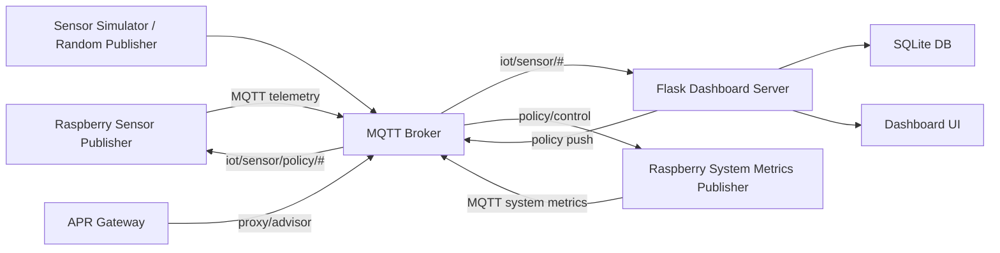

# APR 기반 IoT Platform 상세 분석

작성일: 2026-06-03  
대상 경로: `C:\access\iot`

## 1. Executive Summary

본 시스템은 MQTT 기반 IoT 데이터 수집 대시보드에서 출발하여, payload schema 분석, latency 실험 기록, APR 정책 추천/적용, Raspberry Pi edge publisher, Raspberry system metrics publisher, APR Gateway, Docker 운영 보호 기능까지 확장된 Industrial IoT 실험/운영 플랫폼이다.

핵심 가치는 다음과 같다.

- 기존 MQTT payload를 크게 변경하지 않고 수집/분석 가능
- 센서 데이터와 미정의 payload를 함께 관리
- latency, payload size, QoS, compression, encryption, integrity 정보를 실험 로그로 축적
- APR 정책으로 통신 옵션을 원격 제어
- Raspberry Pi device client와 양방향 정책 topic 구조 보유
- Docker/Windows 운영 전환 시 DB 보호를 위한 shutdown/lock 기능 보유

현재 시스템은 PoC와 기술 검증에는 충분한 기능을 갖추었으나, 상용 운영 단계에서는 DB 구조, system metrics 저장 구조, 운영 프로세스, 인증/보안, broker 장애 대응, 데이터 보존 정책을 보강해야 한다.

## 2. 전체 시스템 구조



주요 런타임 구성:

| 구성 | 설명 |
|---|---|
| MQTT Broker | 원격 broker `218.146.225.166:1883` 사용 |
| Dashboard server | Flask 기반 `server.py` |
| Database | SQLite `iot_data.db` |
| Docker service | `iot-dashboard` |
| Device client | `device/raspi_iot_publisher.py` |
| System metrics client | `device/raspi_system_metrics_publisher.py` |
| APR Gateway | `apr_gateway/` 독립 서비스 |

## 3. 주요 디렉터리와 역할

| 경로 | 역할 |
|---|---|
| `server.py` | 핵심 dashboard/API/MQTT subscriber/APR orchestration |
| `database/db_manager.py` | 비동기 DB writer |
| `policy/` | APR 정책 추천, payload codec, compression/encryption/integrity 처리 |
| `monitor/` | queue monitor |
| `templates/` | Flask HTML dashboard templates |
| `static/` | dashboard CSS/JS |
| `device/` | Raspberry Pi publisher 및 설정 |
| `apr_gateway/` | 별도 APR Optimization Gateway |
| `tools/` | DB 복구 등 운영 도구 |
| `docs/` | 제안서, 소개 자료, 운영/분석 문서 |

## 4. Dashboard Server 분석

핵심 파일:

```text
server.py
```

주요 역할:

- MQTT subscribe
- payload decode
- schema 분류
- sensor data 저장
- unknown payload 저장
- experiment log 저장
- APR metric collection
- APR policy push
- dashboard API 제공
- system shutdown/lock 관리

주요 설정:

```python
DB_NAME = os.environ.get("DB_NAME", "iot_data.db")
DB_JOURNAL_MODE = os.environ.get("DB_JOURNAL_MODE", "WAL").upper()
DB_BUSY_TIMEOUT_MS = int(os.environ.get("DB_BUSY_TIMEOUT_MS", "30000"))
SYSTEM_MODE = os.environ.get("SYSTEM_MODE", "windows")
SYSTEM_LOCK_FILE = os.environ.get("SYSTEM_LOCK_FILE", os.path.join("runtime", "iot_dashboard.lock"))
```

의미:

- Windows 직접 실행과 Docker 실행을 모두 지원
- DB 위치를 환경변수로 분리
- Windows/Docker 공유 DB의 lock 문제를 줄이기 위해 busy timeout 적용
- 운영 중복 실행 방지를 위해 lock file 사용

## 5. MQTT 수신 흐름

서버는 `start_mqtt()`에서 MQTT client를 생성하고 `iot/sensor/#`를 구독한다.

```text
MQTT broker
→ iot/sensor/# subscribe
→ on_message()
→ payload decode
→ schema 판단
→ sensor_data 또는 unknown_payload_data 저장
→ experiment_log 저장
→ APR collection/evaluation
```

정책 topic은 수신 처리에서 제외된다.

```text
iot/sensor/policy/...
```

이는 policy push message가 다시 데이터로 저장되는 것을 방지하기 위한 구조다.

## 6. Payload 분류 구조

서버는 payload가 다음 필드를 포함하면 정의된 센서 데이터로 판단한다.

```text
sensor_id
sensor_type
value
unit
```

그리고 `value`가 float 변환 가능해야 한다.

정의된 payload:

```json
{
  "sensor_id": "temp_001",
  "sensor_type": "temperature",
  "value": 24.3,
  "unit": "C"
}
```

정의되지 않은 payload:

```json
{
  "device_id": "raspi_001",
  "payload_type": "system_metrics",
  "metrics": {
    "cpu_percent": 10.2
  }
}
```

현재 system metrics payload는 단일 topic에 여러 metric을 담기 때문에 `unknown_payload_data` 또는 schema profile 관리 대상으로 분류될 가능성이 높다.

## 7. Database 구조 분석

DB는 SQLite 기반이며 `init_db()`에서 주요 테이블을 생성한다.

주요 테이블:

| 테이블 | 역할 |
|---|---|
| `sensor_data` | 정의된 센서 데이터 저장 |
| `mqtt_experiment_log` | latency/policy/payload 실험 기록 |
| `unknown_payload_data` | 미정의 payload 원문 저장 |
| `unknown_schema_profile` | unknown payload schema fingerprint |
| `apr_policy_log` | APR 정책 결정/피드백 기록 |
| `voice_experiment_results` | voice 관련 실험 결과 |

현재 DB 파일:

```text
C:\access\iot\iot_data.db
```

Docker 내부 경로:

```text
/app/iot_data.db
```

현재 구조의 장점:

- Windows와 Docker가 같은 DB 파일을 볼 수 있음
- 운영자가 Windows에서 DB 파일을 직접 백업/확인 가능
- 개발/검증 단계에서 구조가 단순함

현재 구조의 단점:

- Docker가 Windows bind mount SQLite 파일에 접근하므로 느림
- `DELETE` journal 모드 사용으로 읽기/쓰기 동시성이 제한됨
- lock 대기와 dashboard 출력 지연 가능
- 비정상 종료 시 DB 손상 가능성이 완전히 사라지지는 않음

## 8. DB Writer 분석

파일:

```text
database/db_manager.py
```

DB writer는 queue 기반 비동기 writer다.

주요 특성:

- MQTT callback에서 직접 DB insert하지 않고 queue에 적재
- worker thread가 batch 단위로 commit
- queue depth, committed, failed, dropped 통계 제공
- lock 발생 시 retry

적용된 보강:

```text
DB_BUSY_TIMEOUT_MS=30000
DB_LOCK_RETRIES=10
```

운영 의미:

- DB가 잠겨도 즉시 실패하지 않고 대기
- Windows/Docker 공유 SQLite 환경에서 데이터 손실을 줄임
- 단, API 응답이 느려질 수 있음

## 9. Dashboard UI 분석

주요 template:

```text
templates/dashboard.html
templates/all_dashboard.html
```

주요 JS:

```text
static/js/dashboard_common.js
```

주요 CSS:

```text
static/css/dashboard_common.css
```

UI 기능:

- Single Sensor Dashboard
- All Sensor Multi Panel Dashboard
- 센서별 chart
- payload metadata 설명
- unknown payload 통계
- experiment log
- latency statistics
- 수집 지연 경고
- System Shutdown 버튼

화면 로딩 시 주요 API 호출:

```text
/api/sensors
/api/collection-warnings
/api/config
/api/chart/<sensor_id>
/api/topic-stats
/api/unknown-topic-stats
/api/unknown-payloads
/api/latency-stats
/api/experiment-log
```

분석:

- 기능은 풍부하지만 초기 로딩 시 API 호출이 많음
- SQLite lock이 발생하면 화면 일부가 `-` 또는 `0`으로 표시될 수 있음
- 장기적으로 API batch aggregation 또는 dashboard-specific summary API가 필요함

## 10. System Shutdown / 단일 실행 보호

추가된 기능:

- `GET /api/system/status`
- `POST /api/system/shutdown`
- `runtime/iot_dashboard.lock`

동작:

```text
server start
→ lock 파일 확인
→ 기존 실행 lock이 fresh하면 실행 차단
→ lock heartbeat 갱신
→ shutdown 시 MQTT/DB 정리
→ lock 제거
```

효과:

- Windows와 Docker가 동시에 같은 DB를 쓰는 것을 방지
- dashboard 버튼으로 안전 종료 가능
- DB 손상 가능성 감소

주의:

- Docker 강제 재생성 시 lock 파일이 남을 수 있음
- stale lock 제거 정책은 있으나 운영 절차 문서화가 필요함

## 11. Docker 운영 분석

파일:

```text
docker-compose.yml
```

현재 설정:

```yaml
DB_NAME: /app/iot_data.db
DB_JOURNAL_MODE: DELETE
DB_LOCK_RETRIES: 10
DB_BUSY_TIMEOUT_MS: 30000
SYSTEM_MODE: docker
SYSTEM_LOCK_FILE: /app/runtime/iot_dashboard.lock
```

볼륨:

```yaml
- ./iot_data.db:/app/iot_data.db
- ./runtime:/app/runtime
- ./config.json:/app/config.json:ro
- ./experiment_results:/app/experiment_results
```

운영 명령:

```powershell
docker compose up -d iot-dashboard
docker compose stop iot-dashboard
docker ps
```

분석:

- Windows DB 파일 공유 요구를 충족함
- shutdown 버튼과 `restart: "no"` 조합으로 의도적 종료가 가능함
- 성능/안정성 측면에서는 Docker volume DB가 더 안전함

## 12. APR 정책 엔진 분석

서버 내 정책 엔진:

```text
policy/apr_policy.py
```

APR Gateway 정책 엔진:

```text
apr_gateway/gateway/decision_engine.py
```

정책 요소:

```text
qos
compression
encryption
integrity
```

지원 값:

| 항목 | 값 |
|---|---|
| QoS | `0`, `1` |
| Compression | `none`, `gzip`, `zlib` |
| Encryption | `none`, `AES-GCM` |
| Integrity | `none`, `sha256` |

정책 추천 기준:

- payload size
- latency
- queue depth
- topic criticality
- schema type
- sensitive 여부

ML 사용:

- XGBoost 기반 모델 사용 가능
- 모델 파일이 없거나 예측 실패 시 rule-based fallback 사용
- APR Gateway는 `save_model` 포맷과 joblib fallback을 모두 지원

## 13. APR 정책 Push 구조

정책 push topic:

```text
iot/sensor/policy/<sensor_id>
```

예:

```text
iot/sensor/policy/temp_001
iot/sensor/policy/raspi_001_system
```

정책 message:

```json
{
  "qos": 1,
  "compression": "gzip",
  "encryption": "AES-GCM",
  "integrity": "sha256"
}
```

Device는 해당 topic을 subscribe하고 다음 publish cycle부터 정책을 적용한다.

## 14. Codec / Envelope 구조

파일:

```text
policy/codec.py
```

APR policy가 적용되면 payload는 envelope 구조가 된다.

```json
{
  "metadata": {
    "publish_timestamp": "...",
    "experiment_id": "...",
    "seq": 1,
    "qos": 1,
    "compression": "gzip",
    "encryption": "AES-GCM",
    "integrity": "sha256",
    "hash": "..."
  },
  "data": "base64..."
}
```

처리 순서:

```text
JSON serialize
→ compression
→ encryption
→ integrity hash
→ base64 envelope
```

decode 순서:

```text
base64 decode
→ integrity check
→ decrypt
→ decompress
→ JSON parse
```

## 15. Raspberry Sensor Publisher 분석

파일:

```text
device/raspi_iot_publisher.py
```

설정:

```text
device/client.config
```

기능:

- Raspberry에서 센서 데이터 publish
- APR policy subscribe
- `collect`, `reset_policy`, `default_policy` 명령 처리
- compression/encryption/integrity 적용

기본 topic:

```text
iot/sensor/temperature/temp_001
```

policy topic:

```text
iot/sensor/policy/temp_001
```

실행:

```bash
python raspi_iot_publisher.py --config client.config
```

분석:

- 기존 센서 publisher는 안정적으로 분리되어 있음
- 새 system metrics publisher와 config가 분리되어 영향 없음
- broker timeout 발생 시 코드 문제가 아니라 네트워크/port 접근 문제가 원인일 가능성이 큼

## 16. Raspberry System Metrics Publisher 분석

파일:

```text
device/raspi_system_metrics_publisher.py
```

설정:

```text
device/system_metrics.config
```

수집 항목:

```text
cpu_percent
memory_percent
cpu_temp_c
disk_percent
load_1m
```

추가 지원:

```text
memory_used_mb
memory_total_mb
disk_used_gb
disk_total_gb
```

현재 publish topic:

```text
iot/sensor/system/raspi_001_system
```

payload는 metric별 topic을 만들지 않고 하나의 topic에 묶어서 전송한다.

```json
{
  "device_id": "raspi_001",
  "device_name": "raspberry-pi-edge-001",
  "sensor_id": "raspi_001_system",
  "sensor_type": "system_metrics",
  "payload_type": "system_metrics",
  "metrics": {
    "cpu_percent": 12.4,
    "memory_percent": 45.2,
    "cpu_temp_c": 52.1,
    "disk_percent": 31.8,
    "load_1m": 0.42
  }
}
```

원격 제어:

```json
{
  "command": "set_options",
  "interval": 10,
  "metrics": ["cpu_percent", "memory_percent", "cpu_temp_c"]
}
```

분석:

- 장비 단위 health monitoring 구조에 적합
- 현재 서버는 `metrics` 객체를 별도 테이블로 정규화하지 않음
- dashboard graph에서 metric별 선으로 표시하려면 서버 파싱 확장이 필요함

## 17. APR Gateway 분석

경로:

```text
apr_gateway/
```

주요 파일:

```text
apr_gateway/app.py
apr_gateway/gateway/mqtt_proxy.py
apr_gateway/gateway/decision_engine.py
apr_gateway/gateway/codec.py
```

역할:

- 기존 broker 앞단/옆단에서 MQTT message 구독
- APR 정책 추천
- advisor mode 또는 proxy forwarding
- XGBoost 모델 기반 정책 추천
- metrics API 제공

API:

```text
GET  /health
GET  /api/metrics
GET  /api/policies/current
POST /api/recommend
```

분석:

- ThingsBoard/EMQX/AWS IoT Core를 대체하기보다 앞단 최적화 gateway로 포지셔닝하는 것이 적합
- 현재 dashboard APR과 gateway APR이 일부 중복되므로 역할 분리가 필요함
- gateway는 운영 환경에서 독립 Docker service로 분리하는 것이 바람직함

## 18. Unknown Payload / Schema Fingerprint 분석

미정의 payload 처리 기능은 본 시스템의 중요한 차별점이다.

처리 대상:

- JSON이지만 정의된 센서 schema가 아닌 payload
- non-JSON payload
- 복호화 실패 payload
- system metrics combined payload

저장:

```text
unknown_payload_data
unknown_schema_profile
```

장점:

- 기존 MQTT payload를 수정하지 않고도 관찰 가능
- PoC에서 고객 설비의 기존 payload를 그대로 수집 가능
- unknown schema fingerprint로 데이터 구조 분석 가능

한계:

- unknown payload가 많아질 경우 저장량 증가
- 중요한 payload는 최종적으로 전용 parser/table로 승격 필요

## 19. 수집 지연 경고 분석

기능:

- 최근 수신 timestamp 기반 평균 수집 간격 계산
- 마지막 수신 이후 경과 시간이 평균 x multiplier를 초과하면 경고

설정:

```json
"collection_delay_warning": {
  "enabled": true,
  "late_multiplier": 2,
  "window": 200,
  "min_samples": 5
}
```

UI:

- `수집 지연 경고` ON/OFF
- 지연 기준 multiplier 선택

분석:

- 단순하지만 현장 PoC에서 매우 유용함
- 센서 offline, network delay, broker 문제를 빠르게 감지 가능
- 향후 device heartbeat와 결합하면 더 강력해짐

## 20. 성능 분석

현재 dashboard 출력 지연의 주요 원인:

1. Windows DB 파일을 Docker가 bind mount로 직접 사용
2. SQLite `DELETE` journal mode
3. DB write/read lock 경합
4. dashboard 초기 로딩 API 다수 호출
5. sensor/experiment/unknown 데이터 증가
6. APR feedback/update 중 DB write 발생

완화 조치:

```text
DB_BUSY_TIMEOUT_MS=30000
DB_LOCK_RETRIES=10
DB writer queue
dashboard optional API fallback
```

하지만 구조적 해결은 아니다. 장기적으로는 DB 운영 방식을 바꿔야 한다.

권장 구조:

```text
PoC: Docker volume SQLite + Windows는 API/backup으로 접근
상용: PostgreSQL 또는 TimescaleDB
```

## 21. 안정성 분석

현재 적용된 안정성 장치:

- system lock file
- graceful shutdown API
- DB writer queue
- DB lock retry
- DB busy timeout
- DB recovery tool
- Docker restart disabled

남은 위험:

- Windows/Docker SQLite 공유 구조
- broker 접속 timeout 시 publisher 종료
- APR feedback 직접 DB update lock 가능성
- system metrics payload 정규 저장 부재
- 인증/권한 없는 shutdown API
- MQTT broker 인증/TLS 미사용 가능성

## 22. 보안 분석

지원 기능:

- MQTT username/password 설정 가능
- TLS 설정 가능
- AES-GCM payload encryption 가능
- SHA256 integrity 가능

현재 위험:

- shutdown API 인증 없음
- dashboard API 인증 없음
- MQTT broker가 공개 IP/1883으로 운영될 경우 접근 통제 필요
- AES key가 config/env에 평문으로 존재 가능
- GitHub에 민감한 `.env` 또는 DB가 올라가지 않도록 관리 필요

권장:

1. Dashboard API token 또는 basic auth
2. MQTT broker ACL
3. TLS listener 사용
4. APR AES key는 환경변수/secret manager 사용
5. shutdown API는 local-only 또는 admin token 필요

## 23. 운영 분석

현재 Docker 실행:

```powershell
cd C:\access\iot
docker compose up -d iot-dashboard
```

상태 확인:

```powershell
docker ps
curl http://127.0.0.1:5000/api/system/status
curl http://127.0.0.1:5000/api/db/status
```

안전 종료:

```powershell
Invoke-WebRequest -UseBasicParsing -Method POST http://127.0.0.1:5000/api/system/shutdown
```

Windows 직접 실행 시:

```powershell
python server.py
```

주의:

- Docker가 실행 중이면 Windows 실행은 lock으로 차단됨
- Windows에서 실행하려면 먼저 Docker shutdown 필요

## 24. 사업/제품 관점 분석

본 시스템은 대형 IoT platform을 대체하는 방향보다, 기존 플랫폼 앞단/옆단에서 동작하는 최적화 overlay 또는 gateway로 포지셔닝하는 것이 적합하다.

유리한 포지션:

```text
APR Optimization Gateway
Industrial IoT Edge Health Monitor
MQTT Payload Observability Layer
Adaptive Communication Policy Engine
```

핵심 고객:

- 스마트팩토리 구축사
- 설비 모니터링 업체
- 제조 데이터 수집 SI
- MQTT 기반 edge gateway 운영사
- 지연/손실/보안 정책이 필요한 산업 IoT 업체

차별점:

- 기존 payload 비침습 수집
- unknown payload 분석
- APR 정책 원격 적용
- latency/payload 기반 운영 데이터 축적
- Raspberry edge client와 실증 가능

## 25. 기술 부채와 개선 우선순위

### P0: 운영 안정성

1. Windows/Docker SQLite 공유 구조 제거
2. shutdown API 인증 추가
3. broker 접속 실패 retry/backoff 강화
4. DB backup/export 명령 표준화

### P1: 데이터 모델

1. `system_metrics` 전용 테이블 추가
2. device registry 테이블 추가
3. heartbeat/last_seen 관리
4. APR policy history 정규화

### P2: Dashboard

1. Raspberry device health dashboard 추가
2. system metrics trend chart 추가
3. dashboard API 통합으로 초기 로딩 최적화
4. slow query/API latency 모니터링

### P3: 상용화

1. PostgreSQL/TimescaleDB 지원
2. multi-tenant 구조
3. 인증/권한/감사 로그
4. Docker compose production profile
5. installer/upgrade script

## 26. 추천 아키텍처 진화

### 현재 PoC 구조

```text
Raspberry → MQTT → Flask Dashboard → SQLite
```

### 단기 권장 구조

```text
Raspberry → MQTT → Dashboard Docker → Docker volume SQLite
Windows → Dashboard API / DB export
```

### 중기 권장 구조

```text
Raspberry/Edge → MQTT Broker → APR Gateway → Dashboard/API → PostgreSQL/TimescaleDB
```

### 상용 구조

```text
Edge Agents
→ MQTT/EMQX
→ APR Optimization Gateway
→ Stream Processor
→ TimescaleDB
→ Dashboard/API
→ Policy Control Plane
```

## 27. 결론

현재 시스템은 단순 센서 dashboard를 넘어 APR 기반 Industrial IoT 통신 최적화 플랫폼의 핵심 기능을 상당 부분 갖추고 있다. 특히 기존 MQTT payload를 그대로 수집하면서 unknown schema 분석, APR 정책 추천, device policy push, Raspberry system health 수집까지 연결된 점은 PoC와 고객 실증에서 강점이다.

다만 현재 운영 구조는 개발/실증 편의성을 우선한 상태다. 상용화하려면 DB 공유 구조를 개선하고, system metrics를 정규 테이블로 저장하며, 인증/보안/운영 자동화를 보강해야 한다.

가장 적절한 다음 단계는 다음과 같다.

1. `system_metrics` payload 전용 저장/조회 API 추가
2. Raspberry device health dashboard 추가
3. Docker volume DB 또는 PostgreSQL 전환
4. shutdown/API 인증 추가
5. APR Gateway와 dashboard 역할 분리

이 방향으로 진행하면 본 시스템은 “새로운 대형 IoT 플랫폼”이 아니라 기존 MQTT/IoT 플랫폼 앞단에서 동작하는 AI 기반 통신 최적화/관측 레이어로 상용화 가능성이 높다.
